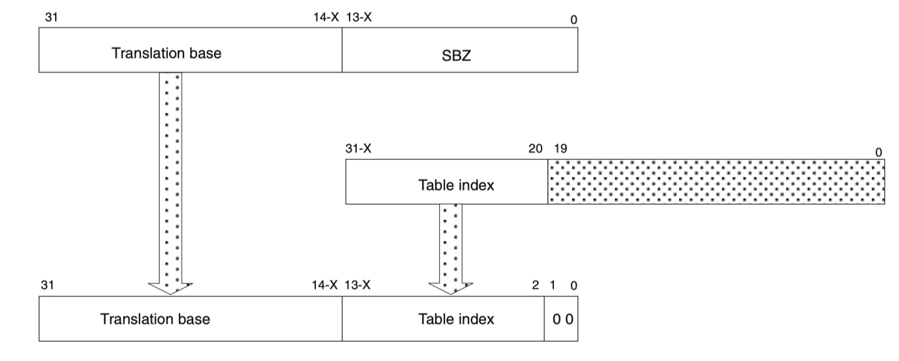

# Virtual Memory

Virtual memory is described in "Chapter B4 Virtual Memory System Architecture" of the [ARMv5 Architecture Reference Manual](https://developer.arm.com/documentation/ddi0100/i/)

The ARMv5 Architecture Reference Manual also describes ARMv4 and ARMv6.

## Links

- https://www.snaums.de/informatik/mmu-on-raspberry-pi.html
- https://github.com/naums/raspberrypi/blob/master/mmu/README.md
- https://codersatellite.com/question-with-identifier-58399436

## Terminology

| Acronym | Term                                                   | Description                                                                                                                           |
| ------- | ------------------------------------------------------ | ------------------------------------------------------------------------------------------------------------------------------------- |
| VMSA    | Virtual Memory System Architecture                     | All features enabling the use of virtual memory                                                                                       |
| MMU     | Memory Management Unit                                 | Hardware that translates virtual to physical memory. The MMU is initially turned off.                                                 |
| VMSAv6  | VMSA in ARMv6                                          | ARMv6 implementation of VMSA                                                                                                          |
| ASID    | Application Space Identifier                           | ID of a process/application                                                                                                           |
| TTW     | Translation Table Walk                                 | All steps necessary to resolve a virtual address to a pyhsical address. See "B4.2 Memory access sequence" in the ARM reference manual |
| TLB     | Translation Lookaside Buffer                           | TLB live inside the MMU and cache the result of TTW speeding up the costly resolution process                                         |
| FCSE    | Fast Context Switch Extension                          | ???                                                                                                                                   |
| CP15    | One of the coprocessors, namely coprocessor number 15. | CP15 is also called the System Control coprocessor. It is affecting VMSA. See "Chapter B3 The System Control Coprocessor"             |

## Overview

https://developer.arm.com/architectures/learn-the-architecture/memory-management/single-page

Virtual Memory uses hardware (the Memory Management Unit (MMU)) to translate virtual addresses to physical addresses.
This allows the system to provide processes with a linear view of the memory that is mapped to real memory. The
mapping is completely transparent for the processes. Each process maintains its own mapping which is used whenever
the process is run on a processor.

Virtual Memory makes the following features possible

- dynamic memory allocation
- running more than one program simultaneously. As as applications are relocated by the linker to the same address,
  if programs were actually loaded to that address, they would override each other in memory. The MMU makes it possible
  to have several applications running by putting them at different locations in physical memory.
- isolation of processes, processes cannot read or override other processes data
- isolation of kernel memory, a user space process cannot read or write the kernel memory
- managing access rights to memory

The mapping is defined by the operating system. The data structures that store the mapping are placed in memory. The
operating system tells the coprocessor where the mappings are stored. The coprocessor points the MMU to those
mappings in memory and the MMU starts to translate virtual to physical addresses. The CPU from now on only ever works with virtual addresses. The coprocessor uses physical addresses. So the physical location of the mapping data structures has to be known even when virtual memory is enabled.

## Contract between the Application and the Operating System

Virtual Memory portraits a linear address space to a process running on the operating system.
For the process, memory starts at address 0 and extends to the maximum address that fits into
the registers of the CPU which is a lot more memory than is pyhsically available for modern
64 bit CPUs.

This begs the question how that unrealistic claim is handled by the operating system and it's
processes in a real scenario. The Raspberry PI 3 Model B+ has one gigabyte of memory and features
a 64 bit CPU which is able to address terrabytes of memory.

The way this situation is treated is by having a software contract between the OS and it's
processes.

The contract states that the operating system will grant the process as much memory as it wants
until the available physical memory is used up and paging/swapping space on the harddrive is used up.
When the physical memory is used up und swap memory is depleted, an exception
is thrown or malloc() and calloc() or new or whatever language mechanism is used to reserve
dynamic memory will fail!

This means that although the process sees a flat, ridiculously large memory space, not all
of that memory space will be usable. The process does not know how much is usable, it just
has to deal with the situation that the OS runs out of memory.

Same contract as with harddrive space. An application has to be able to deal with the situation
in which there is not space left on the disk.

This hopefully clears up misconceptions about virtual memory. A process sees that full virtual
address space, but that does not mean it can actually use that memory. This is physically impossible.

## Translation Tables (sometimes referred to as page tables)

The translation process is initiated when the on-chip TLB does not contain an entry for the requested modified virtual address.

From ARMv5 Architecture Reference Manual (which also describes ARMv6):

> The process of doing a full translation table lookup is called a translation table walk. It is performed automatically by hardware, and has a significant cost in execution time, at least one main memory access, and often two. TLBs reduce the average cost of a memory access by caching the results of translation table walks.

### How are translation tables exchanged on a context swith to another process/application?

From the reference manual:

> To prevent the need for a TLB invalidation on a context switch, each virtual to physical address mapping can be marked as being associated with a particular application space, or as global for all application spaces. Only global mappings and those for the current application space are enabled at any time. By changing the Application Space IDentifier (ASID), the enabled set of virtual to physical address mappings can be altered.

I think what the above means is that it is possible to have one large mapping for all processes/applications. Having one
table gets rid of the need to exchange tables. Instead of exchanging tables, the ASID is changed to the ASID of
the currently executing process. Only mappings matching the ACID or global mappings are enabled at any given point in time.

### Organization of page tables in several levels

Page tables can get large in size up to several megabytes. The size is determined by how many entries are held by a page table. If the memory is split in small pages, a lot of entries are needed to map the up to 8 gigabyte of memory on a raspberry pi for example. The ratio between page table size and available RAM can get wastefull. That is why there are ways to tweek the page table size.

Because page tables can get pretty large, a hierarchy of page tables is used. That means a page table can contain an entry to another page table. The nested page table manages a large chunk of memory and allows the parent page table to contain less entries.

The ARMv5 reference manual states:

> The translation table held in main memory has two levels

It further states

> First-level table Holds section and supersection translations, and pointers to second-level tables.

> Second-level tables Hold both large and small page translations.

Another way to keep page tables small is to make their entries point to large parts of memory. This is a tradeoff between how finely grained memory can be managed and the amount of page table entries it takes to manage memory, i.e. the size of the page tables.

There are four sizes of memory that can be managed by a TLB entry:

- Supersections consist of 16MB blocks of memory (Level 1 Table only)
- Sections consist of 1MB blocks of memory (Level 1 Table only)
- Large pages consist of 64KB blocks of memory (Level 2 Table only)
- Small pages consist of 4KB blocks of memory. (Level 2 Table only)

Tiny Pages have been removed with ARMv6. Tiny Pages had a size of 1KB.

> Translations occur as the result of a TLB miss, and start with a first-level fetch. A section-mapped access only requires a first-level fetch, whereas a page-mapped access also requires a second-level fetch.

That means if you have a entry in the first level table that points to a supersection or a section, no second level table is accessed. Second level tables are only accessed if you put a pointer to second level table into the entry.

### Location of the page table in memory

In VMSAv6, the CP15 has three registers that specify the physical location of the page tables:

- TTBR0 - for process/application specific addresses
- TTBR1 - for operating system specific addresses that do not change on a context switch
- TTBCR - when set to 0 only TTBR0 is used

The physical location of the translation table is also called the base.

TTBR (= Translation Table Base Register)
TTBCR (= Translation Table Base Control Register)

### First level lookup

The input to a First level lookup is a modified virtual address that should be translated to a physical address and the three registers TTBR0, TTBR1 and TTBCR.

A first level lookup yields a so called descriptor.

The first level lookup computes the physical address of an entry in the first level table (descriptor). That address is computed by combining the used Translation Table Base Register (either TTBR0 or TTBR1) with the first bits of the modified virtual address.

The combination will take bits from the TTBR and append bits from the modified virtual address. The amount of bits to take from those two components is actually configurable! It is configured by the value N in TTBCR! Because of it's variance, the combination boundary is called X in many diagrams.

Here is a reproduction of the image "Figure B4-3 Accessing the translation table first-level descriptors" from the ARMv5 specification.

This screenshot is taken from the ARMv5 specification. It shows how the "Translation base" from TTBR0 or TTBR1 and the "Table index" from the modified virtual address are combined at some location X. X is computed by 14 - N. N is taken from TTBCR.

The ARMv6 specification states:

> Under VMSAv6, the Translation Base is always address [31:14] when TTBR1 is selected. However, the value used with TTBR0 varies from address [31:14] to address [31:7] for TTBCR values of N=0 to N=7 respectively.

That means if TTBR1 is selected N is set to 0, no matter which value it has in TTBCR. If TTBR0 is used the value of N is determined by TTBCR.

The table that is pointed to by TTBR1 is always 16KB.
The table that is pointed to by TTBR0 have a size that is determined by the value N from the TTBCR. N is a value between 0 and 7.

### Descriptor Decoding

Remember what was mentioned earlier:

> First-level table Holds section and supersection translations, and pointers to second-level tables.

The descriptor describes either a section or supersection in which no second level lookup is performed. It can also contain a pointer to a second level table in which case the second level lookup is performed to arrive at a pyhsical address within a page.

How does the MMU know wether the first-level entry (descriptor) points to a section or supersection or to a second-level table?
This is specified in section "B4.7.4 First-level descriptors". Every entry in the first-level table has a type. There are four types, two bits are enough to encode four options. The least significat two bits denote the type:

- 00b - unmapped. Accessing an unmapped entry causes a translation fault.
- 01b - entry points to a second-level table (also called coarse second-level table). The "Coarse page table descriptor" describes whether the coarse second-level table points to small pages or large pages.
- 10b - entry points to a section or supersection. No second level access is required.
- 11b - entry points to a fine second-level table as opposed to a coarse second-level table. In ARMv6 fine second-level tables are deprecated and this type of entry should not be used.

### Translating sections and supersections to physical addresses

The ARMv5 reference manual describes how sections and supersections are translated to physical memory in "B4.7.5 Sections and supersections"

The Figure "Figure B4-4 Section translation" from the ARMv6 specification extends the Figure "Figure B4-3 Accessing the translation table first-level descriptors" for sections and supersections.

Once the "Address of first-level descriptor" is assembled, the MMU actually looks into memory at that physical address and inspect the descriptor at that location. This descriptor is drawn in the fourth line of the figure "B4-4" and it is labeled "First-level descriptor". You can see that that First-level descriptor has a type of 10b and therefore describes a section or supersection.

To compute the physical address of the section from this descriptor, the "Section Base Address" from the descriptor is combined with the "Section Index" from the modified virtual address. This is denoted by the arrow pointing down from the "Section Index" to the fifth row of the diagram. That arrow is depicted to extend behind the fourth row in the background which means that the data is transferred from row 2 to row 5 directly and used in row 5 only.

### Translating small pages and large pages

The ARMv5 reference manual describes how Coarse Page Table Descriptors are translated to physical memory in "B4.7.6 Coarse page table descriptor"

The lookup yields the physical address of the second level descriptor. To arrive at that second level descriptor is pretty similar to the section or supersection lookup.

Once the address of the second level descriptor is known, the second level lookup is performed.
The second-level table is 1KB in size and contains 32-bit entries which means (1024 / 32 = 32) that it contains
32 entries.

### Enabling and Disabling the MMU

See "B4.2.3 Enabling and disabling the MMU" in the [ARMv5 Architecture Reference Manual](https://developer.arm.com/documentation/ddi0100/i/).

bit[0] (= M-Bit) of register 1 of the System Control coprocessor (CP15) decides whether or not the MMU is enabled.

- 0 - MMU is disabled
- 1 - MMU is enabled

On reset the bit has a value of 0 and hence the MMU is disabled on reset.

The reference manual states:

> Before the MMU is enabled all relevant CP15 registers must be programmed. This includes setting up suitable translation tables in memory. Prior to enabling the MMU, the instruction cache should be disabled and invalidated. The instruction cache can then be re-enabled at the same time as the MMU is enabled.
> In addition, if the physical address of the code that enables or disables the MMU differs from its modified virtual address, instruction prefetching can cause complications (see PrefetchFlush CP15 register 7 on page B2-19). It is therefore strongly recommended that code which enables or disables the MMU has identical virtual and physical addresses.

This means that code that enables the MMU has to be identity mapped and has to go through the following steps:

- all relevant CP15 registers must be programmed
- set up suitable translation tables in memory
- prior to enabling the MMU, the instruction cache should be disabled and invalidated
- the instruction cache can then be re-enabled at the same time as the MMU is enabled

### Prefetch Abort and Data Abort Exceptions / Interrupt

What happens if an application wants to access memory at a virtual address for which there is no entry in the first- or second-level table yet? A Prefetch Abort or Data Abort Exception / Interrupt is triggered (See the lesson on interrupts).

The exception / interrupt handler for Prefetch- and Data Abort can map memory in by adding an entry to the MMU tables and the make the application continue.
