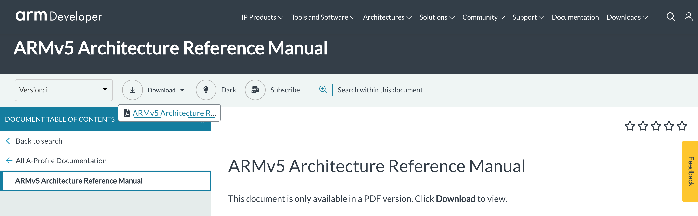

# ARM OS Course

These notes and code are the preparation for a coures that I hopefully can monetize some day on some learning platform.

## Books

Raspbian OS Programming with the Raspberry Pi

## Links

- https://de.wikipedia.org/wiki/Raspberry_Pi
- https://github.com/thibmaek/awesome-raspberry-pi
- https://socialcompare.com/en/comparison/raspberrypi-models-comparison
- https://www.cl.cam.ac.uk/projects/raspberrypi/tutorials/os/
- https://jsandler18.github.io/
- https://github.com/bztsrc/raspi3-tutorial
- https://github.com/s-matyukevich/raspberry-pi-os
- https://ultibo.org/
- https://github.com/ultibohub/
- https://leiradel.github.io/2019/01/28/Bss-and-Peripheral-Base.html
- https://leiradel.github.io/2019/02/10/The-Mini-UART.html
- https://azeria-labs.com/memory-instructions-load-and-store-part-4/
- https://www.lowlevel.eu/wiki/ARM-OS-Dev_f%C3%BCr_Einsteiger
- http://bob.cs.sonoma.edu/IntroCompOrg-RPi/sec-inters.html
- https://www.pieter-jan.com/node/15
- https://learn.sparkfun.com/tutorials/raspberry-gpio/all
- https://github.com/eryjus/century/
- https://www.raspberrypi.org/magpi-issues/Projects_Book_v1.pdf
- https://isometimes.github.io/rpi4-osdev/part8-breakout-ble/

## ARM Documentation

Some general tips for the ARM website. When visiting a link to a document on the ARM website such as the ARMv5 reference manual for example, the page that loads in many cases does not directly contain the document in HTML form! It oftentimes does not even contain a link to download the PDF version! Instead you have to understand the web design of the ARM website. The ARM website contains a bar with more or less randomly selected actions such as switching between the light and dark theme. One of those options is a "Download" option. This is where you actually get access to the PDF version of the document you were looking for.



Also the [ARMv5 Architecture Reference Manual](https://developer.arm.com/documentation/ddi0100/i/) describes ARMv4 and ARMv6 in a single PDF document. Only ARMv7, ARMv8 and all subsequent architectures received their indivdual documentation.

- [ARM Introduction to the Cortex-A53](https://developer.arm.com/ip-products/processors/cortex-a/cortex-a53)
- [ARM Learn the Architecture Cortex-A53](https://developer.arm.com/architectures/learn-the-architecture)
- [ARM Exploration Tools](https://developer.arm.com/architectures/cpu-architecture/a-profile/exploration-tools)
- [ARM Assembly Instructions](https://developer.arm.com/docs/ddi0596/i/base-instructions-alphabetic-order)
- [Programmers Guid](https://developer.arm.com/documentation/den0024/a/preface)

## Development Board

To test the OS on real hardware, the Raspberry PI 3 Model B+ is used.

The specification is contained here: (https://www.raspberrypi.org/products/raspberry-pi-3-model-b-plus)

Specification
The Raspberry Pi 3 Model B+ is the final revision in the Raspberry Pi 3 range.

- CPU: Broadcom BCM2837B0, Cortex-A53 (ARMv8) 64-bit SoC @ 1.4GHz with 4 cores (quad-core)
- RAM: 1GB LPDDR2 SDRAM
- Bluetooth: 2.4GHz and 5GHz IEEE 802.11.b/g/n/ac wireless LAN, Bluetooth 4.2, BLE
- Ethernet: Gigabit Ethernet over USB 2.0 (maximum throughput 300 Mbps)
- GPIO: Extended 40-pin GPIO header
- HDMI: Full-size HDMI
- USB: 4 USB 2.0 ports
- CAMERA: CSI camera port for connecting a Raspberry Pi camera
- DSI: DSI display port for connecting a Raspberry Pi touchscreen display
- AUDIO: 4-pole stereo output and composite video port
- SD-SLOT: Micro SD port for loading your operating system and storing data
- POWER: 5V/2.5A DC power input
- PoE: Power-over-Ethernet (PoE) support (requires separate PoE HAT)

## Docker

[An Introduction to Docker](doc/Docker/README.md)

## GIT

[An Introduction to GIT](doc/git/README.md)

## Setting up the Development Environment

[Development Environment](doc/Environment/README.md)

## Lesson 1 - Baremetal Assembler

[Baremetal Assembler](Lesson01_Assembler/README.md)

## Lesson 2 - Programming in C

[Programming in C](Lesson02_C/README.md)

## Lesson 3 - printf in C

[printf in C](Lesson03_printf/README.md)

## Lesson 4 - Virtual Memory

[Virtual Memory](Lesson04_VirtualMemory/README.md)

## Running the kernel on qemu

https://github.com/bztsrc/raspi3-tutorial/blob/master/README.md

```
qemu-system-aarch64 -M raspi3 -kernel kernel8.img -serial stdio
```

As a Test:
https://raspberrypi.stackexchange.com/questions/34733/how-to-do-qemu-emulation-for-bare-metal-raspberry-pi-images/85135#85135

cd /temp

# Get source.

```
git clone https://github.com/bztsrc/raspi3-tutorial
cd raspi3-tutorial
git checkout efdae4e4b23c5b0eb96292f2384dfc8b5bc87538
```

# Setup to use the host precompiled cross compiler.

# https://github.com/bztsrc/raspi3-tutorial/issues/30

```
apt-get install gcc-aarch64-linux-gnu
find . -name Makefile | xargs sed -i 's/aarch64-elf-/aarch64-linux-gnu-/'
```

# Compile and run stuff.

```
cd 05_uart0
make
/tmp/qemu/aarch64-softmmu/qemu-system-aarch64 -nographic -M raspi3 -kernel kernel8.img -serial stdio
```

Q: Unable to init server: Could not connect: Connection refused\
gtk initialization failed\
A: Use -nographic

Q: EMU 5.0.1 monitor - type 'help' for more information\
(qemu) qemu-system-aarch64: -serial stdio: cannot use stdio by multiple character devices\
qemu-system-aarch64: -serial stdio: could not connect serial device to character backend 'stdio'\
A: Start without -serial stdio

```
/tmp/qemu/aarch64-softmmu/qemu-system-aarch64 -nographic -M raspi3 -kernel kernel8.img
```

## How can I terminate qemu?

Use ^a x
This means, press and hold Ctrl then press a, release Ctrl and a, then press x

## Debugging

https://bertrand.tognoli.fr/todo/work/MyOwnKernel.html

## USB Stack

https://github.com/Chadderz121/csud

You need the USB stack not only for USB devices but also for the ethernet connection,
because the ethernet connection is implemented as a hardware chip that actually converts USB to Ethernet.
https://raspberrypi.stackexchange.com/questions/13241/bare-metal-programming-how-to-access-ethernet-hw-interface

## Drivers

### Driver for External Clock

### Driver for Gyro Sensor

## Networked boot

https://metebalci.com/blog/bare-metal-rpi3-network-boot/

## Networking

https://raspberrypi.stackexchange.com/questions/13241/bare-metal-programming-how-to-access-ethernet-hw-interface

https://ownyourbits.com/2017/02/06/raspbian-on-qemu-with-network-access/

### TCP/IP

## Running the OS on Raspberry PI 3 B+

## Running the OS on BeagleBone Black
